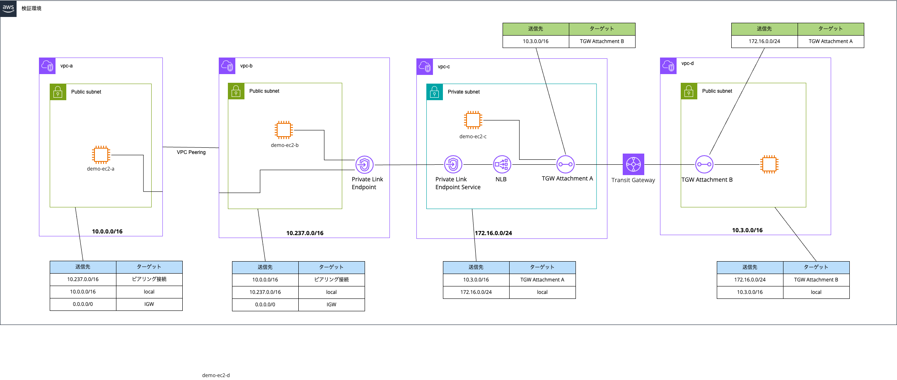

# AWS SAM DynamoDB to SNS Lambda Function

Transit Gateway と Private Link のサンプルです。



## 前提条件

- AWS CLI

## プロジェクトのセットアップ

### 1. リポジトリのクローン

```sh
git clone https://github.com/snakagawax/sample-tgw-privatelink
cd sample-tgw-privatelink
```

### 2. SAMテンプレートのビルド

```sh
sam build
```

### 3. SAMスタックのデプロイ

```sh
sam deploy --guided
```

プロンプトに従って、スタック名、リージョン、その他の設定を入力します。以下は例です：

```plaintext
Stack Name [sam-app]: 
AWS Region [ap-northeast-1]: ap-northeast-1
Confirm changes before deploy [y/N]: Y
Allow SAM CLI IAM role creation [Y/n]: Y
Disable rollback [y/N]: N
DynamoDBToSNSFunction has no authentication. Is this okay? [y/N]: Y
Save arguments to configuration file [Y/n]: Y
SAM configuration file [samconfig.toml]: samconfig.toml
SAM configuration environment [default]: default
```

## SNSサブスクリプションの追加

### 1. 環境変数を設定

```sh
AWS_ACCOUNT=`aws sts get-caller-identity --query Account --output text`
MAIL_ADDRESS_1=foo@example.com
MAIL_ADDRESS_2=bar@example.com
```

### 2. SNSトピックへのEmailサブスクリプション

```sh
aws sns subscribe \
    --topic-arn arn:aws:sns:ap-northeast-1:${AWS_ACCOUNT}:ServiceTopicA \
    --protocol email \
    --notification-endpoint ${MAIL_ADDRESS_1}

aws sns subscribe \
    --topic-arn arn:aws:sns:ap-northeast-1:${AWS_ACCOUNT}:ServiceTopicB \
    --protocol email \
    --notification-endpoint ${MAIL_ADDRESS_2}
```

### 3. サプスクライブする

メールが届くので[Confirm subscription]をクリックする。

## DynamoDBテーブルへのデータ登録

### 1. DynamoDBテーブルへのデータ登録

```sh
aws dynamodb put-item \
    --table-name ServiceTable \
    --item "{
        \"serviceName\": {\"S\": \"ProjectA\"},
        \"snsTopicArn\": {\"S\": \"arn:aws:sns:ap-northeast-1:${AWS_ACCOUNT}:ServiceTopicA\"}
    }"

aws dynamodb put-item \
    --table-name ServiceTable \
    --item "{
        \"serviceName\": {\"S\": \"ProjectB\"},
        \"snsTopicArn\": {\"S\": \"arn:aws:sns:ap-northeast-1:${AWS_ACCOUNT}:ServiceTopicB\"}
    }"
```

## テストの実行

#### 1. AWS CLIを使用したテスト

```sh
aws lambda invoke \
    --invocation-type RequestResponse \
    --function-name sam-app-DynamoDBToSNSFunction \
    --region ap-northeast-1 \
    --log-type Tail \
    --payload fileb://event.json \
    response.json
```

`response.json`ファイルにレスポンスが保存されます。

## クリーンアップ

リソースを削除する場合は、以下のコマンドを実行してスタックを削除します。

```sh
sam delete
```
